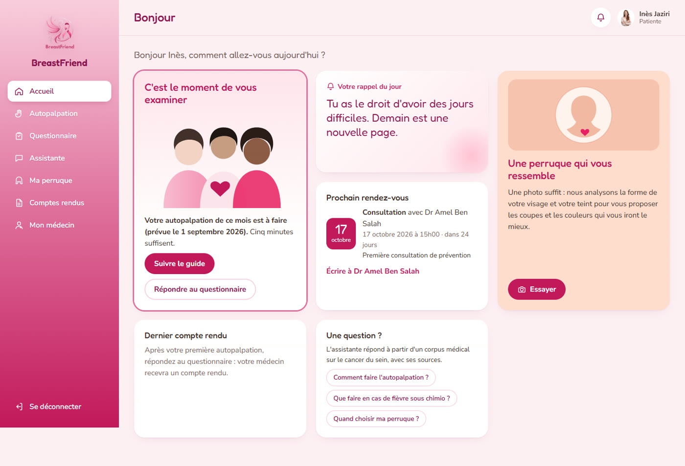
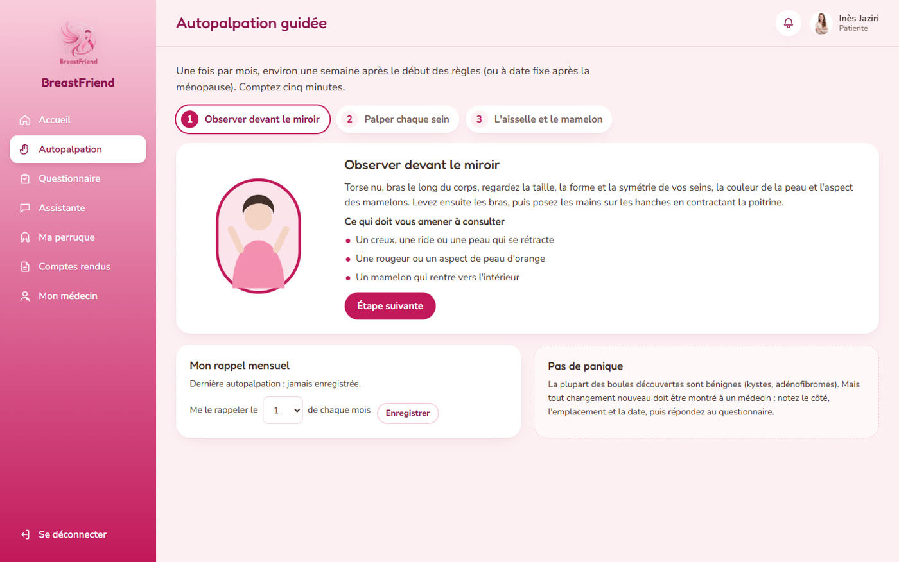
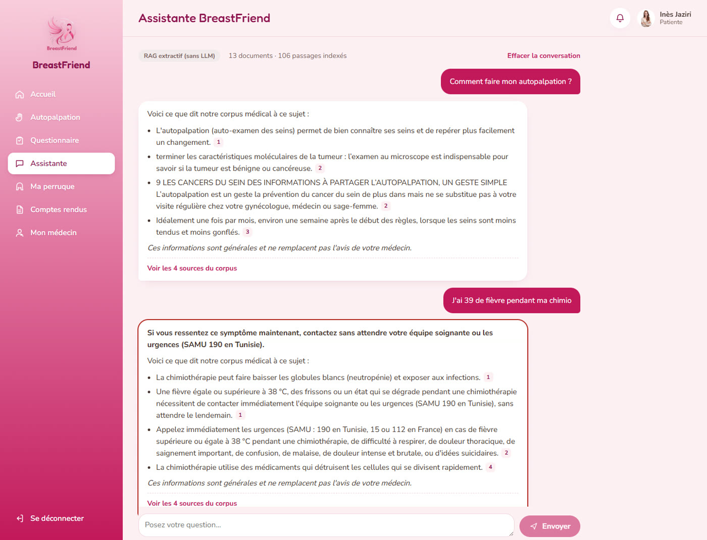
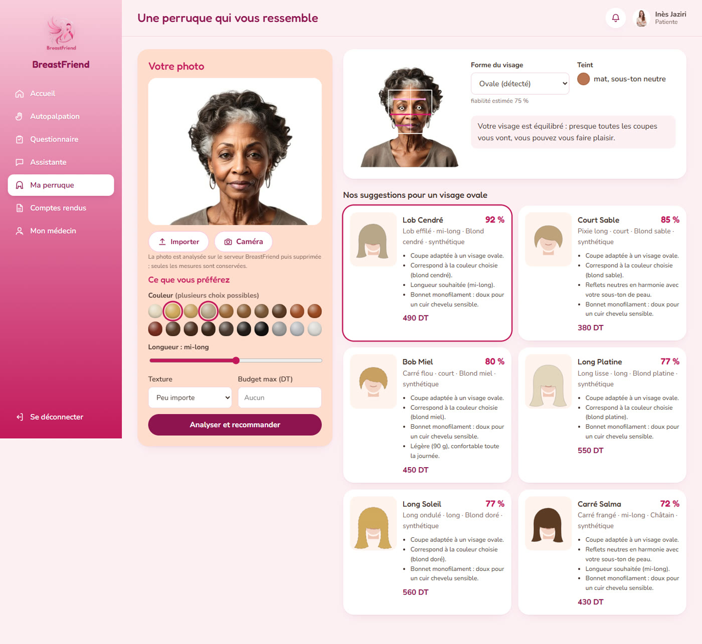
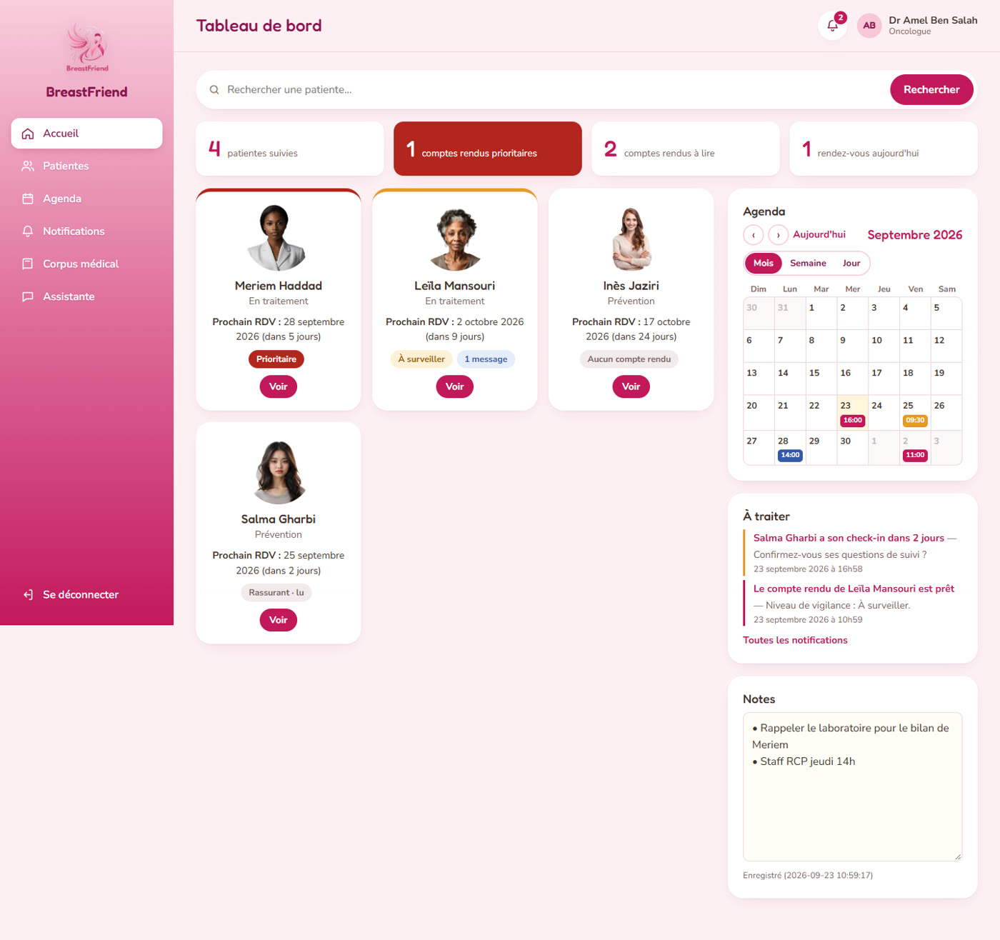
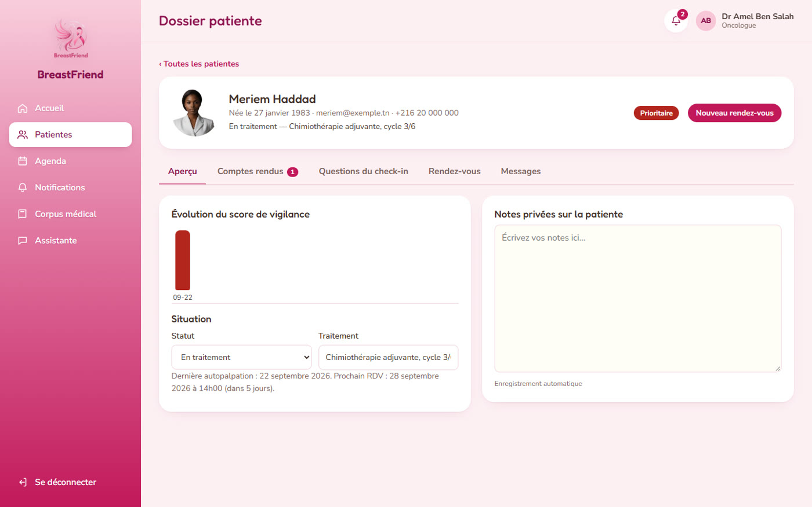

# BreastFriend — Assistante IA en oncologie

**BreastFriend** est une application web qui accompagne les femmes avant, pendant et après un cancer du sein, et fait le lien avec leur médecin.
Elle combine une interface React, un backend Flask, une assistante **RAG** (embeddings, base vectorielle Qdrant, reranker, LLM local ou API) et un **essayage virtuel de perruques en temps réel** dans le navigateur.

> *Parce qu'on a toutes besoin d'une BreastFriend.*
> L'assistante informe à partir de sources validées, cite ses sources, et ne pose jamais de diagnostic.

---

## Aperçu

### Espace patiente

<p align="center">
  
</p>
<p align="center"><em>Accueil patiente : autopalpation du mois, rappel du jour, prochain rendez-vous et accès rapide à l'assistante.</em></p>

<p align="center">
  
</p>
<p align="center"><em>Autopalpation guidée en trois étapes, avec les signes qui doivent amener à consulter et un rappel mensuel.</em></p>

<p align="center">
  
</p>
<p align="center"><em>Assistante : réponses sourcées et détection des urgences (fièvre sous chimiothérapie → consigne SAMU 190 en tête de réponse).</em></p>

<p align="center">
  
</p>
<p align="center"><em>Recommandation de perruques : forme du visage et teint détectés par vision par ordinateur, suggestions classées selon les préférences.</em></p>

### Espace médecin

<p align="center">
  
</p>
<p align="center"><em>Tableau de bord : patientes suivies, comptes rendus prioritaires, agenda, notifications à traiter et notes.</em></p>

<p align="center">
  
</p>
<p align="center"><em>Dossier patiente : évolution du score de vigilance, situation, comptes rendus, questions du check-in, rendez-vous et messagerie.</em></p>

---

## Vue d'ensemble

BreastFriend réunit trois briques dans une seule application :

1. **Un suivi patiente–médecin** : autopalpation guidée, questionnaire de check-in, compte rendu PDF avec triage, agenda, messagerie, notifications et notes.
2. **Une assistante d'information médicale** fondée sur un vrai pipeline RAG : les réponses s'appuient uniquement sur les documents de la base de connaissances et citent le document et la page.
3. **Un espace perruque** : analyse du visage pour recommander des coupes, puis essayage virtuel en direct avec la caméra.

Les calculs factuels (triage, dates, rappels) sont faits en Python ; le modèle de langage rédige, mais ne décide ni n'invente.

---

## Contexte du projet

BreastFriend est né d'un hackathon *Hack for Good with Gen AI*, où il a reçu le **prix Business Impact**.

La question de départ :

> Comment une IA peut-elle aider une patiente à mieux se surveiller, à mieux comprendre sa maladie et à garder le lien avec son médecin, sans jamais se substituer à lui ?

---

## Problème

Entre deux consultations, une patiente reste souvent seule face à ses questions :

- Comment faire correctement son autopalpation, et quand ?
- Ce symptôme est-il urgent ?
- Que veulent dire les termes de mon compte rendu ?
- Comment gérer les effets secondaires de la chimiothérapie ?
- Quelle perruque choisir, et à quoi ressemblerai-je avec ?

Côté médecin, il faut repérer rapidement les patientes qui ont besoin d'attention, sans multiplier les outils.

Un assistant utile doit en plus **ne pas inventer d'informations médicales**, signaler clairement les urgences et protéger des données de santé.

---

## Solution

BreastFriend repose sur quatre principes :

1. **Les documents validés sont la seule source** des informations médicales de l'assistante.
2. **Aucune réponse sans source** : si l'information n'est pas dans la base, l'assistante le dit.
3. **Le médecin reste dans la boucle** : questionnaires, comptes rendus et alertes lui remontent en temps réel.
4. **Les données restent maîtrisées** : mode 100 % local possible (`LOCAL_ONLY`), images de la caméra traitées dans le navigateur uniquement.

---

## Fonctionnalités

### Assistante RAG

- Réponses en français, fondées uniquement sur la base de connaissances
- Citations `[1]`, `[2]` et liste « Sources : fichier — page »
- Recherche hybride : vecteurs + BM25, fusion des classements, reranking
- Message explicite quand l'information est introuvable
- Détection des urgences (fièvre sous chimiothérapie, détresse respiratoire, idées suicidaires…)
- Réponses en streaming
- Historique de conversation limité et séparé de la recherche
- Aucun faux texte si le LLM est indisponible : erreur claire et bouton « Réessayer »

### Base de connaissances (médecin)

- Dépôt de PDF, Markdown ou texte avec barre de progression
- Indexation en arrière-plan : *En attente → Extraction → Embeddings → Indexation → Prêt / Échec*
- OCR des PDF scannés (Tesseract)
- Nombre de pages, pages OCR, pages vides et passages par document
- Suppression, réindexation, aperçu des passages
- Test de requête avec scores de diagnostic
- Document interrogeable dès qu'il est prêt, sans redémarrage

### Suivi patiente–médecin

- Autopalpation guidée et rappel mensuel
- Questionnaire de check-in généré puis validé par le médecin
- Compte rendu avec niveau de vigilance et export PDF
- Agenda (mois / semaine / jour) et rendez-vous
- Messagerie patiente–médecin
- Notifications et notes privées
- **Mises à jour en temps réel** (Server-Sent Events) : plus besoin de rafraîchir la page

### Perruques

- Analyse du visage (OpenCV) : forme du visage, teint et sous-ton
- Recommandations classées selon couleur, longueur, texture et budget
- **Essayage virtuel en direct** : suivi du visage (MediaPipe) dans le navigateur, perruque superposée qui suit la tête
- Réglages : position, taille, rotation, opacité, avant/après, capture locale

---

## Sécurité par conception

L'assistante sépare strictement **recherche**, **contexte** et **génération** :

```text
Question
    ↓
Détection d'urgence
    ↓
Recherche dans les documents
    ↓
Aucun passage pertinent ?  ──→  « Information introuvable » (pas d'appel au LLM)
    ↓
Contexte numéroté [SOURCE n]
    ↓
LLM (règles strictes)
    ↓
Validation des citations
    ↓
Réponse + sources
```

Règles appliquées :

- Le contenu des documents est traité comme **une donnée, jamais comme une instruction** (protection contre l'injection de prompt via un PDF).
- L'assistante **ne pose pas de diagnostic** et ne prescrit rien.
- Une question urgente reçoit toujours la consigne d'urgence, même si le LLM est en panne.
- Chaque route vérifie le rôle et l'appartenance : un médecin ne voit que ses patientes, une patiente que ses propres données.

---

## Architecture RAG

### Ingestion d'un document

```text
PDF / Markdown / TXT
        ↓
Contrôles : type, signature, taille, sha256 (anti-doublon)
        ↓
Extraction page par page  ──  page vide ? ──→  OCR
        ↓
Nettoyage (en-têtes répétés, numéros de page, césures)
        ↓
Découpage par sections et phrases (~700 tokens, recouvrement 100)
        ↓
Embeddings (calculés une seule fois)
        ↓
Qdrant  +  index BM25 (SQLite FTS5)
```

### Question

```text
Question de la patiente
        ↓
Embedding de la requête
        ↓
Recherche vectorielle (20)  ⊕  BM25 (20)
        ↓
Fusion des classements (RRF)
        ↓
Reranker (bge-reranker-v2-m3)
        ↓
5 à 8 meilleurs passages
        ↓
Prompt système + historique limité + contexte + question
        ↓
LLM
        ↓
Réponse citée + « Sources : fichier — page »
```

### Composants

| Étape | Choix par défaut | Alternatives |
|---|---|---|
| Embeddings | `BAAI/bge-m3` (local) | `bge-m3` via Ollama, OpenAI `text-embedding-3-small` |
| Base vectorielle | Qdrant (Docker ou embarqué) | Stockage local SQLite + NumPy |
| Recherche lexicale | BM25 (SQLite FTS5) | désactivable (`RAG_HYBRID=false`) |
| Reranker | `BAAI/bge-reranker-v2-m3` | désactivable (`RERANKER_ENABLED=false`) |
| LLM | Ollama (`qwen2.5:7b-instruct`) | OpenAI (API Responses), vLLM, LM Studio, Groq |

Changer de fournisseur ne demande **aucune modification de code**, seulement le fichier `.env`.

---

## Essayage virtuel

```text
Webcam
   ↓
Repères du visage (MediaPipe Face Landmarker, dans le navigateur)
   ↓
Pose de la tête : position, taille, inclinaison, rotation
   ↓
Lissage (filtre One Euro : sans tremblement ni retard)
   ↓
Transformation de la perruque + réglages manuels
   ↓
Canvas : vidéo + perruque + occultation du visage
   ↓
Aperçu en direct
```

Aucune image de la caméra n'est envoyée au serveur. Une capture n'est créée que si l'utilisatrice clique sur « Capturer », et elle reste sur son appareil.

---

## Stack technique

### Frontend

- React 18
- Vite 5
- Cache de données partagé avec invalidation (inspiré de TanStack Query)
- Server-Sent Events pour le temps réel
- MediaPipe Tasks Vision (Face Landmarker)
- Canvas 2D

### Backend

- Python 3.10 – 3.12
- Flask 3
- SQLite (WAL + migrations versionnées)
- pypdf, Tesseract, pdf2image (extraction et OCR)
- OpenCV (analyse du visage)
- ReportLab (comptes rendus PDF)

### IA

- sentence-transformers : `BAAI/bge-m3`, `BAAI/bge-reranker-v2-m3`
- Qdrant
- Ollama, OpenAI, ou tout serveur compatible OpenAI

### DevOps

- Docker
- Docker Compose (Qdrant + application, Ollama en option)

---

## Structure du projet

```text
BreastFriend/
│
├── README.md
├── docker-compose.yml
├── start.bat / start.sh              # installation + lancement en une commande
│
├── assets/                           # captures d'écran du README
│   ├── 01-accueil-patiente.jpg
│   ├── 02-autopalpation-guidee.jpg
│   ├── 03-assistante-rag.jpg
│   ├── 04-recommandation-perruque.jpg
│   ├── 05-tableau-de-bord-medecin.jpg
│   └── 06-dossier-patiente.jpg
│
├── docs/
│   └── WIG_ASSETS.md                 # format des calques de perruque
│
├── backend/                          # API Flask
│   ├── app.py                        # point d'entrée
│   ├── config.py                     # configuration (.env)
│   ├── database.py                   # SQLite, migrations
│   ├── auth.py                       # sessions, rôles, jetons courts
│   ├── llm.py                        # fournisseurs LLM
│   ├── events.py                     # temps réel (SSE)
│   ├── jobs.py                       # tâches d'arrière-plan
│   ├── questionnaire.py / report.py / services.py / seed.py
│   ├── rag/
│   │   ├── extraction.py             # PDF page par page, OCR
│   │   ├── chunking.py               # découpage structuré
│   │   ├── embeddings.py
│   │   ├── vectorstore.py            # Qdrant / local
│   │   ├── keyword_index.py          # BM25
│   │   ├── fusion.py / reranker.py / retrieval.py
│   │   ├── context.py / prompts.py
│   │   ├── service.py                # registre + pipeline d'ingestion
│   │   ├── chat_service.py           # assistante
│   │   ├── evaluate.py / selfcheck.py
│   │   ├── corpus/                   # corpus médical intégré
│   │   └── eval/dataset.json         # jeu d'évaluation
│   ├── routes/                       # auth, patiente, médecin, chat, commun
│   ├── vision/                       # analyse du visage, catalogue de perruques
│   ├── scripts/                      # génération des calques de perruque
│   ├── static/                       # avatars, calques d'essayage
│   ├── tests/
│   ├── .env.example
│   ├── Dockerfile
│   ├── requirements.txt
│   └── requirements-local-ml.txt
│
└── frontend/                         # React / Vite
    ├── src/
    │   ├── components/               # Layout, TryOn, MessageThread, Calendar…
    │   ├── lib/
    │   │   ├── query.js              # cache de données partagé
    │   │   ├── invalidation.js
    │   │   ├── realtime.jsx          # connexion SSE
    │   │   └── tryon/                # pose, lissage, suivi, rendu
    │   ├── pages/
    │   ├── api.js
    │   └── App.jsx
    ├── scripts/setup-tryon.mjs
    ├── tests/
    ├── package.json
    └── vite.config.js
```

---

## Prérequis

- Python 3.10 – 3.12
- Node.js 18+ et npm
- Ollama (mode local) **ou** une clé OpenAI (mode API)

Optionnel :

- Docker Desktop (Qdrant serveur, déploiement complet)
- Tesseract + pack de langue `fra` et Poppler (OCR des PDF scannés)
- GPU NVIDIA (embeddings, reranker et LLM plus rapides)

---

## Installation — Développement local

### 1. Cloner le dépôt

```bash
git clone https://github.com/YOUR-USERNAME/BreastFriend.git
cd BreastFriend
```

---

### 2. Installer Ollama

Installez Ollama, puis téléchargez le modèle par défaut :

```bash
ollama pull qwen2.5:7b-instruct
```

Ollama doit tourner sur :

```text
http://localhost:11434
```

Choix du modèle selon la machine :

| Machine | Modèle conseillé |
|---|---|
| CPU seul / 8 Go de RAM | `qwen2.5:3b-instruct`, `llama3.2:3b` |
| GPU 6–8 Go | `qwen2.5:7b-instruct`, `mistral:7b-instruct`, `llama3.1:8b` |
| GPU 12–16 Go | `qwen2.5:14b-instruct` |
| GPU 24 Go et plus | `qwen2.5:32b-instruct` |

---

### 3. Configurer le backend

```bash
cd backend
python -m venv .venv
```

Activation sous Windows PowerShell :

```powershell
.\.venv\Scripts\Activate.ps1
```

Sous macOS / Linux :

```bash
source .venv/bin/activate
```

Installer les dépendances :

```bash
pip install -r requirements.txt
pip install -r requirements-local-ml.txt    # modèles locaux bge-m3 + reranker
```

Créer le fichier d'environnement :

```bash
cp .env.example .env
```

Sous Windows PowerShell :

```powershell
Copy-Item .env.example .env
```

Configuration par défaut :

```env
LLM_PROVIDER=ollama
OLLAMA_BASE_URL=http://localhost:11434
OLLAMA_MODEL=qwen2.5:7b-instruct
EMBEDDING_PROVIDER=local
EMBEDDING_MODEL=BAAI/bge-m3
VECTOR_DB=qdrant
QDRANT_URL=
RERANKER_ENABLED=true
```

`QDRANT_URL` vide = Qdrant embarqué (données dans `backend/data/qdrant`). Pour le serveur Docker :

```bash
docker compose up -d qdrant
```

puis `QDRANT_URL=http://localhost:6333`.

Vérifier les composants installés, puis lancer :

```bash
python -m rag.selfcheck
python app.py
```

Backend :

```text
http://127.0.0.1:5000
```

> Au premier lancement, les modèles sont téléchargés (~4,6 Go) et le corpus intégré est indexé en arrière-plan. Les lancements suivants ne recalculent rien.

---

### 4. Configurer le frontend

Dans un second terminal :

```bash
cd frontend
npm install
npm run dev
```

`npm install` copie aussi les fichiers MediaPipe et télécharge le modèle de suivi du visage.

Frontend :

```text
http://localhost:5173
```

---

## Configuration des fournisseurs

| Mode | Variables `.env` |
|---|---|
| 100 % local | `LOCAL_ONLY=true`, `LLM_PROVIDER=ollama`, `EMBEDDING_PROVIDER=local` |
| Local sans PyTorch | `EMBEDDING_PROVIDER=ollama`, `EMBEDDING_MODEL=bge-m3` (`ollama pull bge-m3`) |
| API OpenAI | `LLM_PROVIDER=openai`, `OPENAI_API_KEY=…`, `OPENAI_MODEL=gpt-4.1-mini` |
| vLLM / LM Studio / Groq | `LLM_PROVIDER=openai_compatible`, `LLM_BASE_URL=…/v1`, `LLM_MODEL=…` |
| Machine lente | `RERANKER_ENABLED=false`, `RAG_MIN_VECTOR_SCORE=0.5` |

Toutes les variables sont documentées dans `backend/.env.example`.

> **Confidentialité** : avec un fournisseur distant, les questions et les extraits de documents sont envoyés à ce fournisseur (l'interface l'indique). `LOCAL_ONLY=true` refuse tout fournisseur distant. Les clés d'API ne sont jamais envoyées au navigateur.

---

## Lancement avec Docker

Depuis la racine du dépôt, après avoir créé `backend/.env` :

```bash
docker compose up -d --build
```

Avec Ollama dans Docker :

```bash
docker compose --profile ollama up -d --build
```

Services :

```text
Application : http://localhost:5000
Qdrant :      http://localhost:6333
Ollama :      http://localhost:11434
```

Arrêt :

```bash
docker compose down
```

---

## Comptes de démonstration

Mot de passe pour tous : **`demo1234`**

| Identifiant | Rôle | Situation |
|---|---|---|
| `dr.amel` | Oncologue | 4 patientes, notifications, agenda |
| `meriem` | Patiente sous chimiothérapie | Compte rendu prioritaire |
| `leila` | Patiente en rémission | Compte rendu à surveiller, messages |
| `salma` | Patiente en prévention | Check-in dans 2 jours |
| `ines` | Patiente en prévention | Aucun compte rendu : idéal pour tester le parcours complet |
| `dr.karim`, `yasmine` | Médecin / patiente | Vérifier l'isolation des données |

Code d'invitation pour inscrire un médecin : `BF-MEDECIN-2024`.

---

## Principaux endpoints

### Assistante et base de connaissances

```text
POST   /api/chat
POST   /api/chat/stream
GET    /api/chat/history
DELETE /api/chat/history
GET    /api/rag/status
GET    /api/rag/search                      (médecin)
GET    /api/rag/documents                   (médecin)
POST   /api/rag/documents                   (médecin)
GET    /api/rag/documents/<id>              (médecin)
POST   /api/rag/documents/<id>/reindex      (médecin)
DELETE /api/rag/documents/<id>              (médecin)
```

### Patiente

```text
GET  /api/patient/dashboard
POST /api/patient/self-exam
GET  /api/patient/questionnaire
POST /api/patient/questionnaire
GET  /api/patient/reports
GET  /api/patient/appointments
GET  /api/patient/messages
POST /api/patient/messages
```

### Médecin

```text
GET    /api/doctor/dashboard
GET    /api/doctor/patients
GET    /api/doctor/patients/<id>
PUT    /api/doctor/patients/<id>
POST   /api/doctor/patients/<id>/questions/generate
GET    /api/doctor/reports/<id>
PATCH  /api/doctor/reports/<id>
GET    /api/doctor/appointments
POST   /api/doctor/appointments
PATCH  /api/doctor/appointments/<id>
DELETE /api/doctor/appointments/<id>
```

### Commun

```text
GET  /api/events                  (flux temps réel)
GET  /api/notifications
GET  /api/reports/<id>/pdf
GET  /api/wigs/catalog
POST /api/wigs/analyze
GET  /api/health
```

---

## Évaluation du RAG

Un jeu d'évaluation (`backend/rag/eval/dataset.json`) contient 24 questions construites à partir du corpus, dont 4 sans réponse. Il sert à **mesurer** le RAG, pas à entraîner un modèle.

```bash
cd backend
python -m rag.evaluate              # recherche seule
python -m rag.evaluate --with-llm   # + réponses du LLM
```

Mesures :

- **hit@k** : le bon document est-il dans les k passages retenus ?
- **section@k** et **MRR**
- **rejet** : les questions sans réponse sont-elles bien refusées ?
- **citations correctes** : la réponse cite-t-elle le bon document ?
- **faits clés** et **ancrage** : chaque affirmation est-elle appuyée par sa source ?

Le rapport détaillé est écrit dans `backend/data/eval_report.json`.

---

## Tests

```bash
cd backend
python -m unittest discover -s tests -v

cd ../frontend
npm test
```

Les tests couvrent notamment :

- dépôt, extraction, OCR, découpage et indexation des documents
- doublons, suppression, réindexation, persistance après redémarrage
- recherche, reranking, citations de page, information introuvable
- LLM indisponible, injection de prompt, urgences, streaming
- changement de fournisseur (Ollama, OpenAI, compatible OpenAI) sans modifier le code
- isolation des données entre médecins et entre patientes
- temps réel, calcul de la pose de la tête, lissage, cache frontend

---

## Confidentialité et IA locale

- Le LLM et les embeddings peuvent tourner **entièrement en local** (`LOCAL_ONLY=true`).
- Le suivi du visage fonctionne **dans le navigateur** : aucune image de caméra n'est envoyée.
- Les photos d'analyse de perruque sont supprimées après traitement ; seules les mesures sont gardées.
- Les clés d'API restent côté serveur.
- Les liens PDF et le flux temps réel utilisent des jetons courts (2 min) plutôt que le jeton de session.

---

## Limites

- BreastFriend donne de l'**information générale** et ne remplace pas un avis médical.
- Les calques de perruque actuels sont **illustratifs** : un rendu réaliste demande de vraies photos détourées (voir `docs/WIG_ASSETS.md`).
- Le temps réel et la file d'indexation fonctionnent dans **un seul processus** ; Qdrant embarqué également. En production, utiliser Qdrant sous Docker et Redis.
- Les seuils de pertinence du RAG sont à ajuster avec `python -m rag.evaluate` selon le modèle choisi.
- Les polices web sont chargées depuis Google Fonts ; en mode strictement local, les servir depuis le projet.
- Prototype issu d'un hackathon : un déploiement réel demanderait un durcissement supplémentaire (hébergement de données de santé, audit de sécurité).

---

## Améliorations possibles

- Calques de perruque photoréalistes et rendu 3D
- Redis pour le temps réel multi-processus
- Base de données PostgreSQL
- Chiffrement des données au repos
- Application mobile
- Rappels par e-mail ou SMS
- Pipeline CI/CD
- Évaluation continue du RAG

---

## Contexte

BreastFriend a été développé lors du hackathon **Hack for Good with Gen AI** et récompensé par le **prix Business Impact**.

Le projet associe :

- RAG et LLM (local ou API)
- Vision par ordinateur
- Réalité augmentée dans le navigateur
- Suivi médical patiente–médecin
- Architecture full-stack temps réel

---

## Contact

- **GitHub:** https://github.com/arefbakali
- **LinkedIn:** https://www.linkedin.com/in/aref-bak-ali/
- **Email:** aref.bak-ali@dauphine.eu
- **Portfolio:** https://portfolio-aref.vercel.app/

## Author

**Aref Bak Ali**  
AI, Data Science & Agentic AI Student  
Université Paris Dauphine-PSL

